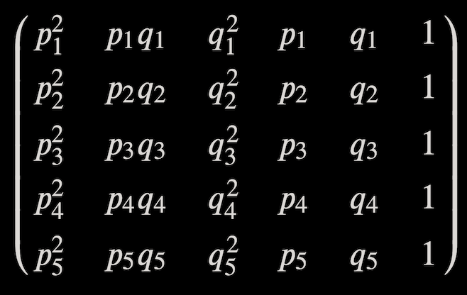

# OrbiTrack
Jack Blair and Daniel DeConti
TJHSST - Matrix Algebra Demonstration Project
May 17th, 2022

## Introduction
Kepler's First Law establishes that all planetary orbits and trajectories are conic sections or can be approximated as such. For a standard two-body system in which a satellite is far less massive than its parent object, this conic section takes the form of an ellipse, when the orbital velocity is less than the object's escape velocity, a parabola when orbital velocity equals escape velocity, and a hyperbola when orbital velocity exceeds escape velocity.

The equations for such conic sections can be calculated through matrix algebra operations, specifically by either finding the determinant of a 6x6 matrix containing the variables for the general form of a conic section:

The equations for such conic sections canbe calculated through matrix algebra operations, specifically by either finding the determinant of a 6x6 matrix containing the variables for the general form of a conic section:

> Ax^2 + Bxy + Cy^2 + Dx + Ey + F = 0

or by taking the null space of a 5x6 matrix of the coordinates augmented with a 5x1 matrix of 1's.

> [A, B, C, D, E, F]

## Drawing with Pygame
In order to display the conic section equation on the screen, we need to convert the A, B, C, D, E, and F coefficients into a Pygame ellipse. The good news is that Pygame has a method to draw any ellipse with a (Semi-major axis, Semi-minor axis, rotation angle, center x, center y) tuple. Luckily, there are formulas to convert these coefficents into these exact parameters:

or by taking the null space of a 5x6 matrix of the coordinates augmented with a 5x1 matrix of 1's. 

## Future Development
The next steps for the development of OrbiTrack include:
1. Modeling the conservation of angular momentum described in Kepler’s Second Law
2. Adding parameterized motion for non-elliptical trajectories 
3. Properly demonstrating the relationship between period and semi-major axis described by Kepler’s Third Law 
4. Modeling the long-term orbital motion of N-body systems where objects have non-negligible mass compared to one another 
5. Plotting three-dimensional shapes using similar matrix-based techniques
